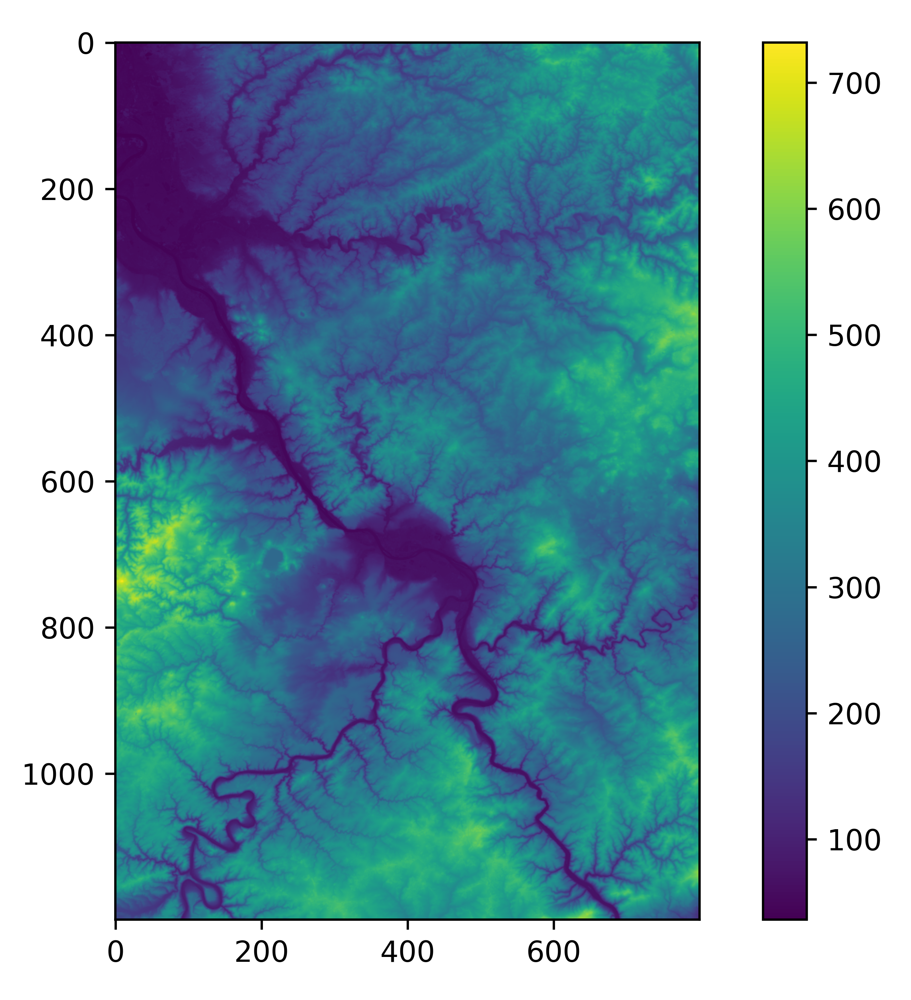
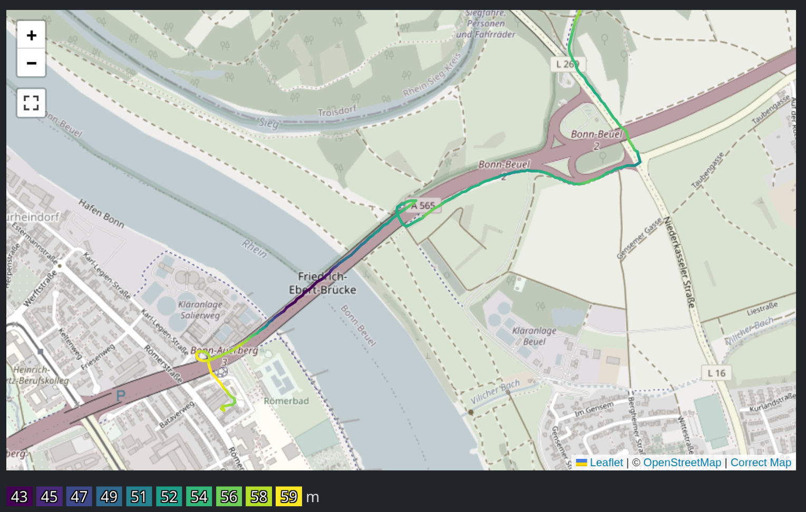
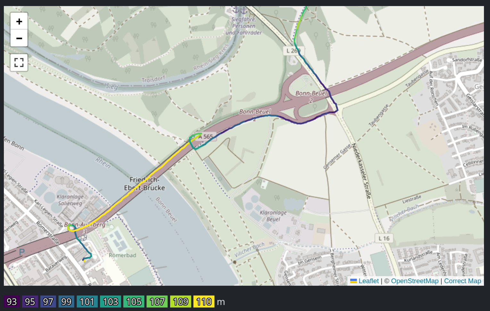
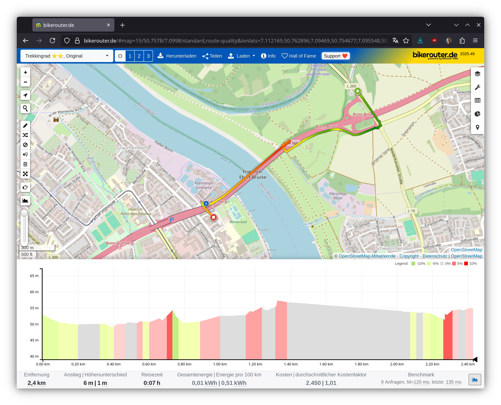

# Satellite Elevation Isn’t Helpful

As you can read in [Elevation Gain from Noisy Data](elevation-gain-from-noisy-data.md), there are certain problems when computing the elevation gain from the GPS measurements. Basically the jitter in the measurements yields to a lot of fake elevation gain when there was none.

One way to improve the situation is to use a _digital elevation model_ (DEM) where one takes elevation data from elsewhere and computes the elevation based on that. This makes sure that the elevation at every point is unique and doesn't depend on GPS measurement errors. One readily available source is the [Copernicus DEM](https://dataspace.copernicus.eu/explore-data/data-collections/copernicus-contributing-missions/collections-description/COP-DEM) provided by the EU.

One can download elevation maps with a resolution of roughly 30 m. Rendered in false-color, they look like this:

Integrating that into the project allows to compare them. The following is the elevation data extracted from Copernicus DEM:

As you can see, the bridge is taken as the lowest point. With a resolution of 30 m, the bridge likely isn't included. Hence the points have the elevation of the river and are much lower.

Compare that to the data that was recorded with GPS and without a barometer:

Here the bridge is the highest point. However, the absolute numbers are wildly different. I have no idea why they are around 100 m. The Rhine river valley is rather around 50 m, so the DEM has better numbers.

The problem is that when computing the elevation gain from the DEM data, it counts as if I went down to the river and back up. But that's not the case, I went up the ramp for the bridge and stayed on that level over the river.

So although that data is good, it isn't of the right kind for this project.

## LiDAR data

Looking at [Bike Router](https://bikerouter.de/), which uses [Sonny’s LiDAR Digital Terrain Models of Europe](https://sonny.4lima.de/), has a bit more accuracy. There the bridge seems to have a better height:

Perhaps it is worthwhile to integrate Sonny's data into this project at some point. It might be better than what is measured with cheap GPS trackers.

## Tunnels and overpasses

There still the fundamental issue that there can only be one elevation per coordinate. That means that if one has an intersection of a bridge and an underpass, the intersection point will have one particular value. And that value will be wrong for one of them. With a longer tunnel, this is even worse.

So no matter how good the data is, the underlying assumption is already wrong. And therefore if one is interested in serious elevation gain data, one needs to invest into a better measurement device with a barometer.